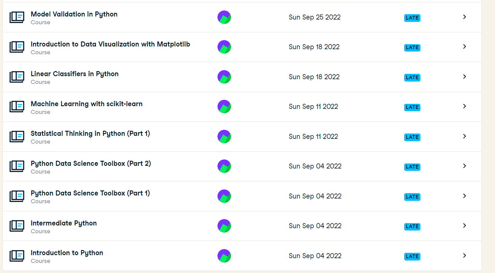
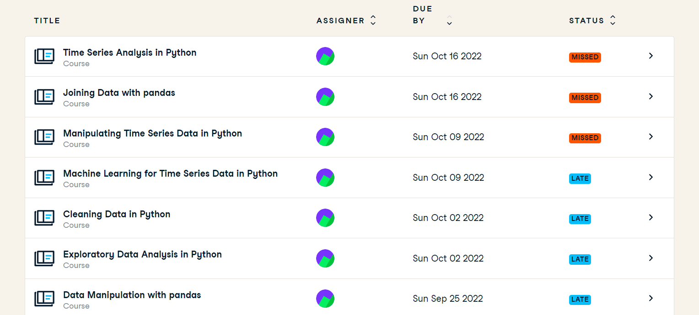
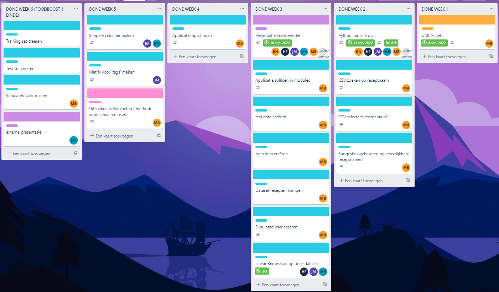
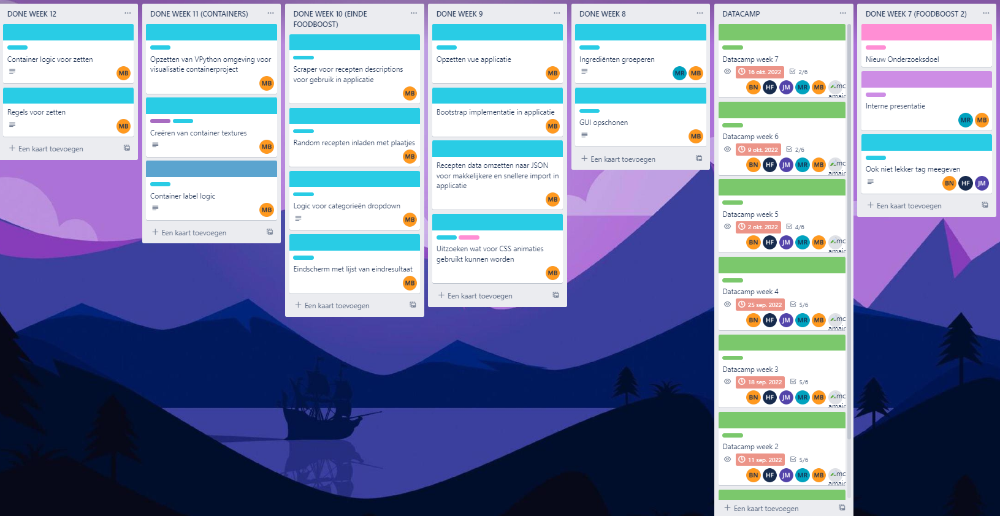
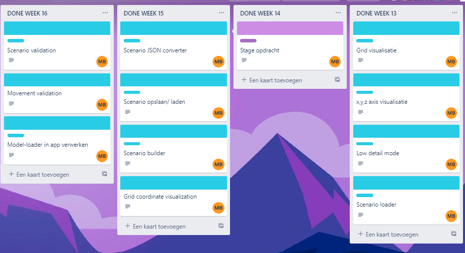
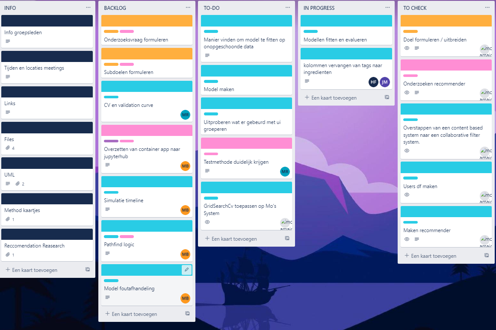

# ADS Portfolio - Mohamed Amajoud (20198752)

**Naam:** Mohamed Amajoud\
**Studentnummer:** 20198752\
**Course:** Applied Data Science

## Inhoud

[1. Introductie](#1-Introductie)\
[2. Datacamp courses](#2-Datacamp-courses)\
[3. Research project](#3-Research-project)\
&nbsp;&nbsp;&nbsp;&nbsp;&nbsp;&nbsp;[3.1 Task definition](#31-Task-definition)\
&nbsp;&nbsp;&nbsp;&nbsp;&nbsp;&nbsp;[3.2 Evaluation](#32-Evaluation)\
&nbsp;&nbsp;&nbsp;&nbsp;&nbsp;&nbsp;[3.3 Conclusions](#33-Conclusions)\
&nbsp;&nbsp;&nbsp;&nbsp;&nbsp;&nbsp;[3.4 Planning](#34-Planning)\
[4. Predictive Analytics](#4-Predictive-Analytics)\
&nbsp;&nbsp;&nbsp;&nbsp;&nbsp;&nbsp;[4.1 Selecting a Model](#41-Selecting-a-Model)\
&nbsp;&nbsp;&nbsp;&nbsp;&nbsp;&nbsp;[4.2 Configuring a Model](#42-Configuring-a-Model)\
&nbsp;&nbsp;&nbsp;&nbsp;&nbsp;&nbsp;[4.3 Training a model](#43-Training-a-model)\
&nbsp;&nbsp;&nbsp;&nbsp;&nbsp;&nbsp;[4.4 Evaluating a model](#44-Evaluating-a-model)\
&nbsp;&nbsp;&nbsp;&nbsp;&nbsp;&nbsp;[4.5 Visualizing the outcome of a model (explanatory)](#45-Visualizing-the-outcome-of-a-model-explanatory)\
[5. Domain knowledge](#5-Domain-knowledge)\
&nbsp;&nbsp;&nbsp;&nbsp;&nbsp;&nbsp;[5.1 Introduction of the subject field](#51-Introduction-of-the-subject-field)\
&nbsp;&nbsp;&nbsp;&nbsp;&nbsp;&nbsp;[5.2 Literature research](#52-Literature-research)\
&nbsp;&nbsp;&nbsp;&nbsp;&nbsp;&nbsp;[5.3 Explanation of Terminology, jargon and definitions](#53-Explanation-of-Terminology-jargon-and-definitions)\
[6. Data preprocessing](#6-Data-preprocessing)\
&nbsp;&nbsp;&nbsp;&nbsp;&nbsp;&nbsp;[6.1 Data exploration](#61-Data-exploration)\
&nbsp;&nbsp;&nbsp;&nbsp;&nbsp;&nbsp;[6.2 Data cleansing](#62-Data-cleaning)\
&nbsp;&nbsp;&nbsp;&nbsp;&nbsp;&nbsp;[6.3 Data preparation](#63-Data-preparation)\
&nbsp;&nbsp;&nbsp;&nbsp;&nbsp;&nbsp;[6.4 Data explanation](#64-Data-explanation)\
&nbsp;&nbsp;&nbsp;&nbsp;&nbsp;&nbsp;[6.5 Data visualization (exploratory)](#65-Data-visualization-exploratory)\

# 1. Introductie

Dit is mijn portfolio waar ik zal doornemen to all mijn contributies. Voor dit project is niet alleen een groeps research project uitgevoerd maar heb ik ook een indiviuele uitgevoerd aangezien ik en de rest mijn van mijn groep 2 verschillende stukjes aanpakte van het container project.

Mijn contributie aan voor het schrijven van het research project vind je in deze 2 files
[Research_Validatie](documenten/Research Paper ADS.pdf)
[Conclusie_Discussie](documents/ADS_Research_v3.pdf)

Ander Notebooks met korte uitleg die van toepassing zijn voor de portfolio zijn:

[Visualisatie-Gif](notebooks/2023-01-13 14-16-55.mkv)
>Visualisatie voor de container environment, de cirkel is de agent die leert om optimaal mogelijk de target container te pakken(rood) en dummy containers vermijden(groen en blauw)

[Concept Create Users.csv](notebooks/Fakers.ipynb)
>in deze notebook wordt een userscsv bestand gemaakt door middel van 100 user id's te maken met elk 10 entries in de csv bestand(dit zijn dan 1000 rijen in de csv). verder wordt aan elke recept een globale rating gegeven(elk instantie van de recept id heeft dezelfde rating). daarna worden er aan elke user een random tage meegegeven waarop basis daarvan 10 random recepten gekozen worden die die tag bezitten. de id's van deze 10 recepten worden aan de csv toegevoegd samen met de bijbehornede rating. [Users.csv](Data/users.csv)

[Csv files merge foodboost](notebooks/Food_Merge_2_Mo (1).ipynb)
>in deze file worden de 4 foodboost dataset (tags, ingredients, recepis en nutritions) in 1 dataset samengevoegd. [merge bestand](Data/food_merge_2.csv)

[Concept create simusers redacted](notebooks/Simur.ipynb)
>oud en fout concept om simulated users te maken door middel van objecten te maken.

[Concept Neural network Recommender](notebooks/main.ipynb)
>neuraal netwerk die ik van het internet heb afgehaald en heb aangepast om een andere dataset te gebruiken(dit notebook was voornamelijk bedoeld om te leren en is geen contributie aan mijn portfolio)

[Container environment](notebooks/mint.py)
>De environment die ik heb gemaakt voor het container project. 5x5 grid met container (gekleurde vakjes) met een agent die leert om de juiste contaier te pakken van de juiste kant zoder tegen andere containers aan te botsen of te pakken. 

[Prediction model recipes](notebooks/pred.ipynb)
>prediction model met de surprise library die op basis van ratings users gaat vergelijken en op basis daarvan voorspellingen maken. Er wordt gebruik gemaakt van de surprise library

[Concept Visual for containers](notebooks/visual.py)
>concept grid voor di visualisatie van de container environment

# 2. Datacamp courses

<details>
<summary>Open om alle <i>Statements of Accomplishments</i> te zien</summary>



 </details>


# 3. Research project

## 3.1 Task definition

Zoals in de introductie is genoemd zijn er 2 research projecten gemaakt waarbij ik aan beide heb gewerkt
De groeps hoofdvraag gaat als volgt:

> Hoe kunnen we de containers op de kade zo optimaal mogelijk neerzetten zodat de zeevaartschepen zo min mogelijk hoeven te wachten?
Aan de hoofdvraag kunt u zien dat deze hoofdvraag maar een onderdeel betreft van het proces van cofano namelijk het indelen van de kade maar in het echte leven zijn er ook andere gebieden waar gelet op moet worden. Gebieden zoals het evalueren van de kade en het inladen van de containers op de zeeschepen. Ik heb me voornamelijk gericht op het evalueren van de kade met als hoofdvraag:

> Hoe kunnen we de opstelling op de kade evalueren om tot een optimale oplossing te komen?
Dit hoofdvraag brengt deelproblemen met zich mee die niet in het onderzoek behandeld worden maar wel rekening mee gehouden moet worden. Een voorbeeld is hoe kunnen we rekening houden met random events zoals bijvoorbeeld dat de planning van zeevaarschepen afwijkt.

Voor het foodboost probleem was er ook een hoofdvraag geformuleerd namelijk:
> Hoe kunnen we op de beste manieer recepten recommenden aan gebruikers.
Het probleem is namelijk dat we een app moeten bouwen die recepten kan recommenden aan gebruikers die bepaalde behoeftes kunnen hebben. behoeftes zoals bijvoorbeeld dat ze geen vlees eten of dat ze voornamelijk deserts willen eten bijvoorbeeld. Het probleem is namelijk dat er ook geen user data is die we kunnen gebruiken. Hiervoor wordt er gebruik gemaakt van een recipes and reviews dataset van kaggle waarbij user duidelijk hebben aangegeven welke rating ze voor een bepaald gerecht geven. De datasets komen van:  https://www.kaggle.com/datasets/irkaal/foodcom-recipes-and-reviews

## 3.2 Evaluation

Voor het hoofdonderzoek zou er meerdere aanpassingen gedaan moeten worden. De reward functie zou schaalbaar moeten zijn zonder dat de code aangepast hoeft te worden. De observation zou rekening moeten kunnen houden met de verwachte volgorde van zeeschepen. Snelheid optimaliseren is zeker ook een optie aangezieen het 5 minuten duurt om een lege 3x3x3 te vullen en verder zou er een stapsgewijze evaluatie toegevoegd moeten worden.

Voor toekomstig werk in mijn indiviuele container project zou ik het evaluatie spel dat ik gemaakt hebben verder uitbreiden met functionaliteit. Hoe het nu werkt is in principe een 2d spel om de kortste route te vinden. Alhoewel leuk blijft inferieur vergeleken met bijvoorbeeld dijkstra die het werk van mijn spel in een paar micro seconden kan doen. Om de applicatie uittebreiden zou ik ervoor zorgen dat de agent een container kan oppaken en verplaatsen om bij andere containers te komen. Verder zou ik de environment de hoogte in brengen om meer complexiteit te intergreren en het wat meer te laten lijken op een yard van cofano. Rekening houden ment de volgorde van zeeschepen is ook iets wat geimplemteerd zou moeten en vooral als we het concept van random event introduceren.

Voor het foodboost project zou er verdere functionaliteit kunnen worden geimplementeerd worden in het filteren van recepten. Nu werkt het nog inmiddels met collaborative filtering wat houdt dat recepten worden aangeboden op basis wat soort gelijke user hebben gegeten. maar dat houdt geen rekening met bijvoorbeeld dat een gerecht vegetarisch moet zijn of bijvoorbeeld weingig koolhydraten.

## 3.3 Conclusions

Voor het container project wordt er bij een model die is ontwikkeld in 350k timesteps gedurende 334 seconden de loss en value loss wordt geminimaliseerd. Het is het model gelukt om bij een yard van 3x3x3 een opstelling optimaal mogelijk ingedeeld te hebben omdat het niet uitmaakt of zeeschip 1,2 of 3 binnenkomt, de stacker kan bij ze allemaal.

Voor het foodboost project kan er geconcludeerd worden dat er goede en passede recommendations gegeven worden. deze worden gegeven door een gridsearch model die op basis van de rating die users hebben gegeven, users kan clusteren en recepten recommenden. Het model kan accuraat aanbevelingen geven aangezien het uieindelijke situatie een rmse geeft van 1. dit houdt in dat de aanbeveling die het model maakt er maximaal 0.5 punten van de rating naast zit. de ratings zijn van 1 tot 5.

## 3.4 Planning

Als scrum omgevingen zijn we elke week bij elkaar gekomen om de bespreken hoe ver we zijn en wat er nog gedaan moet worden. Al onze tickets en werkzaamheden zijn via trello en de agile methodiek opgenomen. We hebben daily standups 3x in de week genomen.

<details>
<summary>Open om alle scrum te zien</summary>





 </details>
 
 zoals u aan screenshot 4 kunnen zien worden sprints verdeeld over 4 kolommen: Backlog, To-Do, In-Progress en To-Check en konden we tijdens de daily standup zien waar iedereen mee bezig was.

# 4. Predictive Analytics

## 4.1 Selecting a model

voor het foodboost project is er gebruik gemaakt van de gridsearchcv van de surprise library. De surprise library is gekozen aangezien de library bedoeld en gemaakt is om recommendation systemen te maken. gridsearchcv is gekozen omdat dit model de beste scores uiteidelijk gaf. andere modellen die zijn uitgeprobeerd zijn de knnwithmeans, knnbaseline, knnbasic en SVD. Verder Dit wordr ondersteund door de documentatie van die library https://surprise.readthedocs.io/en/stable/getting_started.html#tune-algorithm-parameters-with-gridsearchcv 

## 4.2 Configuring a Model

Zoals hiervoor benoemd wordt er gebruik gemaakt de gridsearchcv door het feit dat het model zelf kiest wat de best hyper parameters zijn om tot de laagste rmse te komen. De beste parameters waren dus uiteindelijk:

```json
{
  "n_epochs": 100,
  "lr_all": 0.01,
  "reg_all": 0.1
}
```

[Zie hier het notebook voor de GridSearch](notebooks/pred.ipynb)

## 4.3 Training a model

Zoals hiervoor benoemd is er een gridsearch gebruikt om tot de optimale hyper parameters te komen. De dataset bestod uit user id's, repect id's en de bijhorende rating. Deze dataset is gesplits in 0.75 aan trainen en 0.25 voor het testen. verder wordt de rmse, mae en de beste paramets geprint die uit de gridsearch zijn gebleken. verder is er een cross validation van 5 meegegeven.

## 4.4 Evaluating a model
Het evalueren van het model werd gedaan door middel van veel verschillende modellen uittesten en te vergelijken. uiteindelijk bleek dat dit model de beste resultaten gaf: GridSearchCV(SVD, param_grid, measures=["rmse", "mae"], cv=5, refit = True)

de hier onder staan de verschillende metrieken and de beste parameters die eruit zijn gekomen.

{'rmse': 1.0379689355371358, 'mae': 0.6200058703029125}
{'rmse': {'n_epochs': 100, 'lr_all': 0.01, 'reg_all': 0.1}, 'mae': {'n_epochs': 100, 'lr_all': 0.01, 'reg_all': 0.1}}

verder is uitgeprobeerd om een rating prediction te maken: 
```py
prediction = gs.predict(41, 48730)
prediction.est
4.50464
```
in dit geval is er gekeken naar user id 41 en probeert het model te voorspellen wat voor rating user 41 zal geven aan recept 48730.
het uiteindelijke rating is 4.5 wat houdt in dat recept 48730 een goede aanbeveling zou kunnen zijn. 
[Zie hier het notebook voor de GridSearch](notebooks/pred.ipynb)

## 4.5 Visualizing the outcome of a model (explanatory)

Voor de food boost predictie model die ik gemaakt heb is de uitkomst helaas niet gevisualiseerd. 

voor het evalueren van het container project heb ik wel een visualisatie gemaakt. De visualisatie is een 5x5 grid waarbij de agent(cirkel) de target container moet bereiken(de rode container) en de dummy containers vermijden(groen en blauw).
[Zie hier het notebook voor de visualisatie](notebooks/2023-01-13 14-16-55.mkv)

# 5. Domain knowledge

## 5.1 Introduction of the subject field

Tijdens het container project heb ik gewerkt aan een evaluatie model die samen gekoppeld zou kunnen worden aan de optimale indeling model van mijn projecct groep. Het container project van cofano heeft het probleem dat de container process niet optimaal verloopt. dit kost tonnen aan geld aangezien de zeevaartschepen op de kade moeten wachten voor hun containers. Vaak zijn er meerdere yards van LxBxH grootte die optimaal ingedeeld moeten worden zodat de zeevaartschepen zo min mogelijk hoeven te wachten. 

Voor foodboost project is het probleem dat er recepten aanbevolen moeten worden aan gebruikers die ze ook daadwerkelijk zouden kunne gebruiken. dit is om zo veel klanten te behouden om te voorkomen dat ze de app verwijderen en nooit meer terug komen.

## 5.2 Literature research

foodboost project:
recommendations systemen zijn geen nieuw onderwerp, er is al veel onderzoek naar gedaan en meerdere mogelijkheden uigeprobeerd. De meeste grote bedijven zijn overgestapt naar een collaborative filtering systeem wat inhoud dat de data van gelijkwaardige users gebruikt wordt om aanbevelingen te geven aan die users.

Ik heb vervolgens de volgende onderzoeken gelezen:

- [recommendation-systems-explained](https://towardsdatascience.com/recommendation-systems-explained-a42fc60591ed)
- [machine learning for recommending systems part 1](https://medium.com/recombee-blog/machine-learning-for-recommender-systems-part-1-algorithms-evaluation-and-cold-start-6f696683d0ed)
- [machine learning for recommending systems part 2](https://medium.com/recombee-blog/machine-learning-for-recommender-systems-part-2-deep-recommendation-sequence-prediction-automl-f134bc79d66b)
- [Notebook_Onderzoek](documents/Reccomender Reseasch.txt)


## 5.3 Explanation of Terminology, jargon and definitions

- **Scrum**: Scrum is een agile framework voor het devolopen van producten in groepen/teams.
- **Hyper parameters**: Een waarde die effect heeft op het leer proces van het machine learning model
- **Grid search**: Grid search is een techniek die probeert de optimale waarden van hyperparameters te berekenen [bron](https://medium.com/fintechexplained/what-is-grid-search-c01fe886ef0a)
- **Precision**: Precision is een indicator van de prestaties van een machine learning-model, de kwaliteit van een positieve voorspelling van het model [bron](https://c3.ai/glossary/machine-learning/precision/)
- **Collaborative Filtering**: Collaborative filtering is een methode om automatische voorspellingen (filteren) over de interessen van een gebruiker te maken door voorkeuren of smaakinformatie van veel gebruikers te verzamelen (samenwerken).[bron](https://en.wikipedia.org/wiki/Collaborative_filtering)
- **Recommendation Systeem**: Een aanbevelingssysteem is een systeem dat beoordelingen voorspelt die een gebruiker aan een specifiek item kan geven. Deze voorspellingen worden vervolgens gerangschikt en teruggekeerd naar de gebruiker.[bron](https://towardsdatascience.com/recommendation-systems-explained-a42fc60591ed)
- **Yard**: Een containerwerf (CY) is de plek waar zeecontainers voor en na een afvaart worden opgeslagen en waar vervoerders lege containers opslaan.[bron](https://www.flexport.com/glossary/container-yard/#:~:text=A%20container%20yard%20(CY)%20is,%5C)
- **RMSE**: Root Mean Square Error (RMSE) is de standaarddeviatie van de residuen (voorspellingsfouten). Residuen zijn een maat voor hoe ver de gegevenspunten van de regressielijn verwijderd zijn; RMSE is een maat voor hoe verspreid deze residuen zijn. Met andere woorden, het vertelt u hoe geconcentreerd de gegevens zijn rond de best passende lijn.[bron](https://www.statisticshowto.com/probability-and-statistics/regression-analysis/rmse-root-mean-square-error/)
- **MAE**: MAE is het gemiddelde van de absolute waarden van de individuele voorspellingsfouten over alle instanties. Elke voorspellingsfout is het verschil tussen de werkelijke waarde en de voorspelde waarde voor de instantie.[bron](https://link.springer.com/referenceworkentry/10.1007/978-0-387-30164-8_525)
- **Learning Rate**: De Learning Rate is een hyperparameter die bepaalt hoeveel het model moet veranderen in reactie op de geschatte fout telkens wanneer de modelgewichten worden bijgewerkt.[bron](https://machinelearningmastery.com/understand-the-dynamics-of-learning-rate-on-deep-learning-neural-networks/)
- **Cross-validation**: Cross-validation is een resampling-methode die verschillende delen van de gegevens gebruikt om een model op verschillende iteraties te testen en te trainen. Het wordt voornamelijk gebruikt in omgevingen waar het doel voorspelling is, en men wil inschatten hoe nauwkeurig een voorspellend model in de praktijk zal presteren.[bron](https://en.wikipedia.org/wiki/Cross-validation_(statistics))

# 6. Data preprocessing

## 6.1 Data exploration

Jaap heeft zich bezig gehouden met de data exploration. Ik heb daar veder geen bijdragen aan geleverd.

## 6.2 Data cleaning

De audio bestanden uit onze dataset beginnen en eidigen vaak met een stuk silte. Wij hebben librosa gebruikt om deze stilte eraf te trimmen. Dit leide namelijk tot een betere presatie van de models.

```py
def _process_audio(value):
    x, sample_rate = librosa.load(value['file_path'], sr=44100)
    x, index = librosa.effects.trim(x, top_db=20)
    return x, sample_rate
```

## 6.3 Data preparation

Voor data preparation/preprocessing heb ik meerde dingen gedaan.

Helemaal in het begin had ik een pipeline voor het processen van audio files naar MFCC. Zie hier het [notebook](assets/notebooks/mfcc.ipynb). Deze pipeline hebben wij in het vervolg van het project niet meer gebruikt.

Julian heeft in dit project de pipeline opgezet. Deze bestaat uit `Generators`, `DatasetLoaders` en `Processables`. Later in het project heb ik augmentation toe gevoegd aan de pipeline voor de data van de CNN. Zie hier een implementatie van de [processable met augmentation](assets/notebooks/processable.ipynb). Na het testen met de augmentation had dit alleen maar negatief effect op de CNN en hebben wij dit niet gebruikt. Veder heb ik ook nog een aantal imlementaties gemaakt op basis van de `DatasetLoader`. [zie hier het notebook](assets/notebooks/dataset_loader.ipynb). Ik heb niet alle implementaties gemaakt in dit notebook.

## 6.4 Data explanation

Voor dit project hebben wij meerdere datasets gecombineerd tot een grote dataset. Wij hebben de volgende datasets gebruikt:

1. [CREMA-D](https://www.kaggle.com/ejlok1/cremad)
2. [RAVDESS](https://www.kaggle.com/uwrfkaggler/ravdess-emotional-speech-audio)
3. [SAVEE](https://www.kaggle.com/barelydedicated/savee-database)
4. [TESS](https://www.kaggle.com/ejlok1/toronto-emotional-speech-set-tess)

|                      | RAVDESS                                                                | CREMA-D                                             | TESS                                                           | SAVEE                                                          |
| -------------------- | ---------------------------------------------------------------------- | --------------------------------------------------- | -------------------------------------------------------------- | -------------------------------------------------------------- |
| Aantal samples       | 7356                                                                   | 7442                                                | 2800                                                           | 480                                                            |
| Aantal audio samples | 1440                                                                   | 7442                                                | 2800                                                           | 480                                                            |
| Aantal acteurs       | 24 (12 man, 12 vrouw)                                                  | 91 (48 man, 43 vrouw)                               | 2 (0 man, 2 vrouw)                                             | 4 (4 man, 0 vrouw)                                             |
| Emoties              | Anger<br>Disgust<br>Fear<br>Happy<br>Neutral<br>Sad<br>Calm<br>Suprise | Anger<br>Disgust<br>Fear<br>Happy<br>Neutral<br>Sad | Anger<br>Disgust<br>Fear<br>Happy<br>Neutral<br>Sad<br>Suprise | Anger<br>Disgust<br>Fear<br>Happy<br>Neutral<br>Sad<br>Suprise |

Zoals je ziet heeft niet elke dataset dezelfde emoties. Wij hebben dan ook samen met Dr. Hani al-Ers besproken om op de volgende emoties te focussen:

- Anger
- Happy
- Neutral
- Sad

## 6.5 Data visualization (exploratory)

Wij hebben dit project voornaamlijk gewerkt met audio data. Audio kan je op veel manieren weergeven. Een van de meest gebruikte manieren is een spectrogram. Hieronder zie je twee verschillende samples. De eerste is van een neutrale sample en de tweede is een angry sample. Je kunt wel verschil zien tussen de twee spectrogramen, maar audio blijft wel een van de moeilijkere dingen om af te lezen. [Dit artiekel](https://www.izotope.com/en/learn/understanding-spectrograms.html) heeft mij erg geholpen met het beter kunnen lezen van spectrogrammen.


